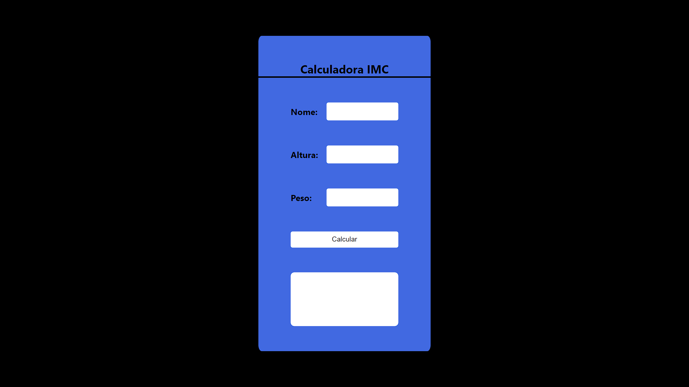

# IMC

---

[Clique aqui](https://oswaldbarbosa.github.io/imc/) para acessar o site

---

## Sobre
Projeto do [Professor Leonid](https://github.com/fernandoleonid) que fiz para consolidar meus conhecimentos em JavaScript.

---

## Tecnologias utilizadas
- HTML5
- CSS3
- JavaScript
- Markdown

---

## Autor 
- [Oswaldo Barbosa](https://www.linkedin.com/in/oswaldo-barbosa/)
